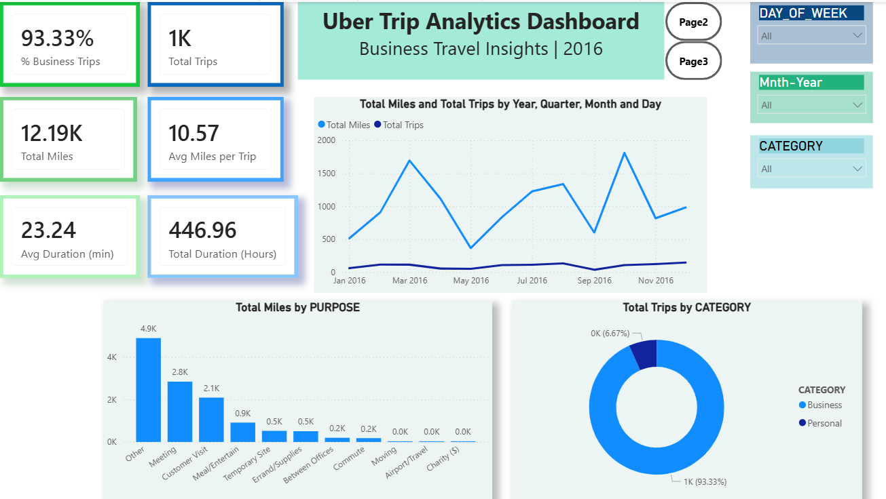
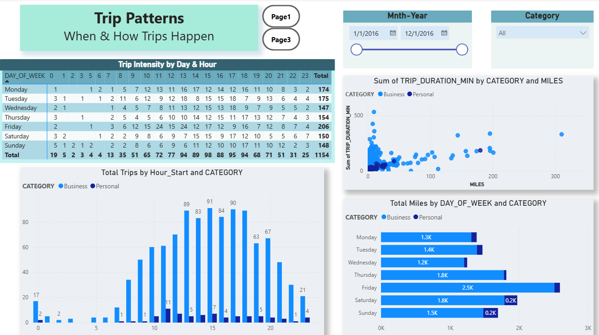
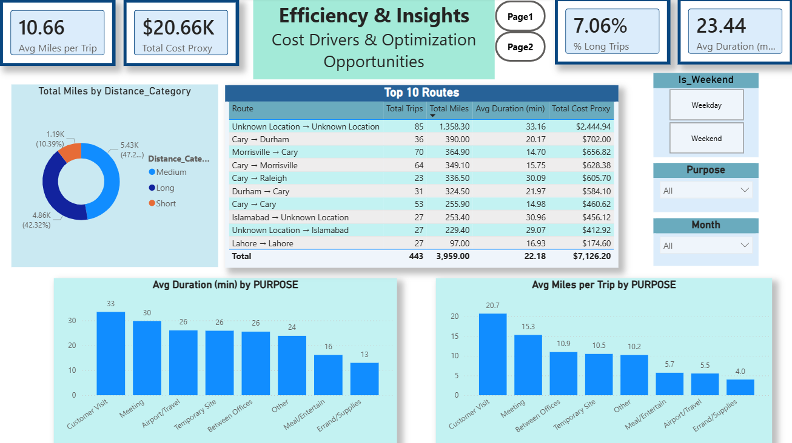

#  Uber Trip Analytics Dashboard

### Business Travel Insights | Power BI Project

---

## معرفی پروژه

این پروژه با استفاده از **Power BI** طراحی شده و هدف آن تحلیل داده‌های سفرهای Uber در سال 2016 است.

در این داشبورد، داده‌ها پس از پاکسازی و آماده‌سازی، با استفاده از **Power Query**، **DAX** و مدل‌سازی داده تحلیل شده‌اند تا الگوهای سفر، شاخص‌های کلیدی عملکرد (KPIs) و فرصت‌های بهینه‌سازی هزینه شناسایی شوند.

این پروژه به عنوان نمونه‌کار (Portfolio) برای موقعیت **Data Analyst Intern** توسعه داده شده است.

---

##  Dashboard Preview

---

#  Dashboard Pages

## 1. Overview

این صفحه نمای کلی عملکرد سفرها را نمایش می‌دهد.

### شامل:

- Total Trips
- Total Miles
- Average Miles per Trip
- Average Duration
- Business vs Personal Trips
- Total Miles by Purpose
- Monthly Trip Trend

 

---

## 2. Trip Patterns

در این صفحه الگوهای زمانی و رفتاری سفرها بررسی شده‌اند.

### شامل:

- Heatmap سفرها بر اساس روز و ساعت
- Trips by Hour
- Miles by Day of Week
- Scatter Plot (Miles vs Duration)

---

## 3. Efficiency & Insights

این صفحه برای استخراج بینش‌های مدیریتی طراحی شده است.

### شامل:

- Top 10 Routes
- Cost Proxy
- Distance Category
- Average Duration by Purpose
- Average Miles by Purpose

---

#  KPIs

این داشبورد شاخص‌های زیر را محاسبه می‌کند:

- Total Trips
- Business Trips %
- Total Miles
- Average Miles per Trip
- Average Trip Duration
- Long Trips %
- Cost Proxy

---

#  Technologies Used

- Power BI Desktop
- Power Query
- DAX
- Microsoft Excel

---

#  Skills Demonstrated

- Data Cleaning
- Data Transformation
- Data Modeling
- DAX Measures
- KPI Design
- Interactive Dashboard Design
- Business Intelligence
- Data Visualization

---

#  Project Files

| File | Description |
|------|-------------|
| Uber Trip Analytics.pbix | Power BI Report |
| Uber_Trips.xlsx | Dataset |
| Documentation.pdf | Project Documentation |

---

#  Documentation

برای مشاهده توضیحات کامل پروژه، فایل زیر را مطالعه کنید:

**Documentation.pdf**

---

#  Author

**Mohammad Hossein Valizadeh**

Aspiring Data Analyst
